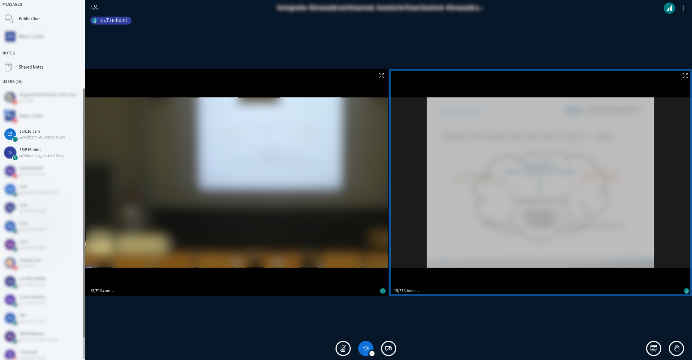

# BigBlueButton Network Camera Integration

This is a prototype to use network cameras as scheduled streams in [BigBlueButton](https://bigbluebutton.org/) meetings.



You will currently need to run one instance of this prototype per stream.

## Prerequisites

This integration uses `selenium` with the chrome driver to control the BBB UI
and the [v4l2loopback](https://github.com/umlaeute/v4l2loopback) kernel module
and `ffmpeg` to capture the camera stream.

On a `Ubuntu 20.04` machine you will need to install the following dependencies:

```console
sudo apt install make gcc python3-pip python3-venv sysstat ffmpeg v4l-utils alsa-base alsa-utils pavucontrol
```

### Install the `v4l2loopback` module:

```
# get the source
git clone https://github.com/umlaeute/v4l2loopback.git
cd v4l2loopback

# make and install
make
sudo make install

# load
sudo depmod -a
```

_See also the [v4l2loopback documentation](https://github.com/umlaeute/v4l2loopback)_

### Install Chrome

```
wget https://dl.google.com/linux/direct/google-chrome-stable_current_amd64.deb

sudo apt install google-chrome-stable_current_amd64.deb
```

## Installation

```
# Clone this repository
git clone https://github.com/elan-ev/bbb-network-cam-integration.git
cd bbb-network-cam-integration

# Create and activate a virtual environment
python -m venv venv
source venv/bin/activate

# Install requirements
pip3 install -r requirements.txt
```

Add the user that is running the process to the following groups:

```
sudo usermod -aG video $USER
sudo usermod -aG root $USER
```

## Optional Steps

It might be helpful to allow passwordless sudo for the user:

```
sudo visudo

#append the following line to the file:
bbb-cam ALL=(ALL) NOPASSWD:ALL
```

## Configuration

### Stream Scheduling

The scheduling of the streams works through a config file in yaml format
that accesible by an URL and is protected with basic auth.

The config file is organized by streaming instance that contain the schedules
with the respective metadata to connect to the meeting and camera.

An example file looks like this:

```yaml
---
clients:
  # Instance 1, needs to be the same as 'HOSTNAME' in service config below
  bbb-cam01.example.com:
    schedule:
      - audio: "rtsp://camera1.exmple.de/stream"
        id: camera1
        location: "<YOUR-STUDIP-MEETING-LINK>"
        start: "2022-12-1T15:00:00+0100"
        stop: 2022-12-1T16:00:00+0100
        video: "rtsp://camera1.exmple.de/stream"
      - audio: "rtsp://camera1.exmple.de/stream"
        id: camera1
        location: "<YOUR-GREENLIGHT-MEETING-LINK>"
        start: "2022-1-31T15:00:00+0100"
        stop: 2022-1-31T16:00:00+0100
        video: "rtsp://camera1.exmple.de/stream"
  # Instance 2, needs to be the same as 'HOSTNAME' in service config below
  bbb-cam02.example.com:
    schedule:
      - audio: ""  # no audio stream
        id: camera2-without-audio
        location: "<YOUR-STUDIP-MEETING-LINK>"
        start: 2022-11-9T14:30:00+0100
        stop: 2022-11-9T16:00:00+0100
        video: "rtsp://camera2.exmple.de/stream"
      - audio: "rtsp://camera3.exmple.de/stream"
        id: camera3-with-audio
        location: "<YOUR-GREENLIGHT-MEETING-LINK>"
        start: 2022-11-9T14:30:00+0100
        stop: 2022-11-9T16:00:00+0100
        video: "rtsp://camera3.exmple.de/stream"

infrastructure:
  greenlight.example.de: greenlight
  studip.example.de: studip
```

### Configure The Service

You need to set the following variables in `cam_supervisor.py`:

variable | example value | description
---|---|---
`YAML_ADDRESS` | `"https://bbb-cam-config.example.com/config.yml"` | the url of the config file
`YAML_AUTH` | `("your-user", "your-password")` | a tuple with the credentials for the basic auth of the config location
`HOSTNAME` | `"bbb-cam.example.com"` | the name of the current instance, needed to look up the scheduled streams

Then start the system by running (from inside the virtual environment):

```
python3 cam_supervisor.py
```
